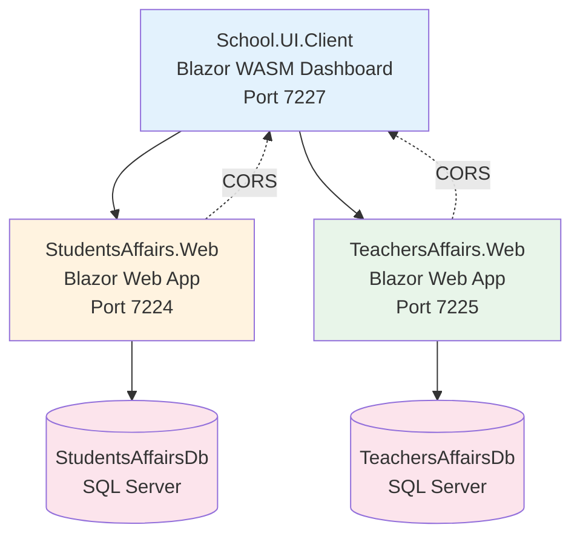
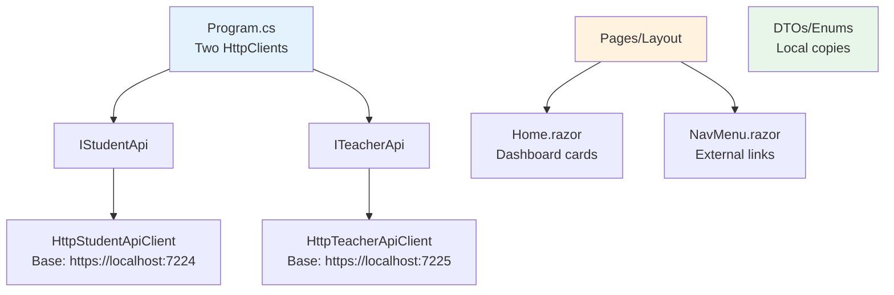
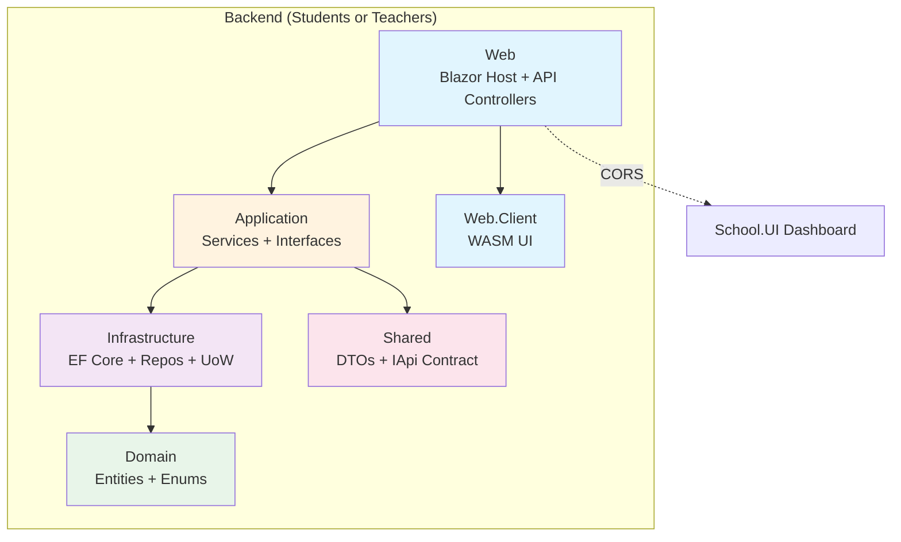
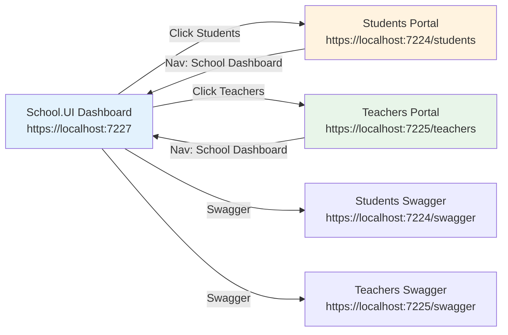

# School.UI — Unified Dashboard

A **Blazor WebAssembly** (.NET 10) dashboard that provides a single entry point to the **Students Affairs** and **Teachers Affairs** applications via CORS-enabled REST APIs.

---

## Solution Overview

```
School.UI.Client (WASM Dashboard)
    │
    ├── CORS → https://localhost:7224  (Students Affairs API)
    │       ├── /api/students
    │       └── /swagger
    │
    └── CORS → https://localhost:7225  (Teachers Affairs API)
            ├── /api/teachers
            └── /swagger
```

Each backend (`StudentsAffairsAPI`, `TeachersAffairsAPI`) is a **complete n-tier Blazor Web App** with:
- **Domain** — Entities & enums (no dependencies)
- **Shared** — DTOs + API contracts (`IStudentApi`, `ITeacherApi`)
- **Application** — Services, Repository/UoW interfaces, mapping
- **Infrastructure** — EF Core, SQL Server, Migrations, Seeding
- **Web** — Blazor host + API Controllers + Composition root
- **Web.Client** — Blazor WASM UI (pages, forms, typed HttpClient)

---

## Architecture Graphs

### 1. High-Level System Diagram



### 2. School.UI.Client Internal Structure



### 3. Students/Teachers Backend (Each Identical Pattern)



### 4. Navigation Flow



---

## Prerequisites

- **.NET SDK 10.0**
- **SQL Server** (LocalDB or full instance) with Windows Authentication
- Connection strings in each Web project's `appsettings.json`

---

## Run the Complete System

### Option 1: Three Terminals (Development)

```bash
# Terminal 1 — Students API
cd StudentsAffairsAPI/src/StudentsAffairs.Web
dotnet run --urls "https://localhost:7224;http://localhost:5135"

# Terminal 2 — Teachers API
cd TeachersAffairsAPI/src/TeachersAffairs.Web
dotnet run --urls "https://localhost:7225;http://localhost:5136"

# Terminal 3 — School UI Dashboard
cd School.UI/src/School.UI.Client
dotnet run --urls "https://localhost:7227;http://localhost:5138"
```

### Option 2: Using the Solution File

```bash
# Restore & build everything
dotnet build school.slnx

# Run each project from its directory (as above)
```

### First Run Behavior
On startup, each API automatically:
1. Applies pending EF Core migrations
2. Seeds **5 demo students** / **5 demo teachers**

---

## Access Points

| Application | URL | Purpose |
|-------------|-----|---------|
| **School.UI Dashboard** | `https://localhost:7227` | Unified entry point |
| **Students Portal** | `https://localhost:7224` | Full student management |
| **Students List** | `https://localhost:7224/students` | Paged, searchable grid |
| **Students API** | `https://localhost:7224/api/students` | REST endpoints |
| **Students Swagger** | `https://localhost:7224/swagger` | API explorer |
| **Teachers Portal** | `https://localhost:7225` | Full teacher management |
| **Teachers List** | `https://localhost:7225/teachers` | Paged, searchable grid |
| **Teachers API** | `https://localhost:7225/api/teachers` | REST endpoints |
| **Teachers Swagger** | `https://localhost:7225/swagger` | API explorer |

---

## Key Design Decisions

| Decision | Rationale |
|----------|-----------|
| **Separate databases** | `StudentsAffairsDb` + `TeachersAffairsDb` — true bounded contexts |
| **CORS from dashboard** | School.UI is read-only gateway; portals own their UI/state |
| **Typed HttpClients** | `AddHttpClient<IStudentApi, HttpStudentApiClient>` with base addresses |
| **Local DTOs in School.UI** | Avoids shared assembly coupling; dashboard only needs read models |
| **External links (`target="_blank"`)** | Keeps each app's Blazor circuit independent |

---

## Project Structure

```
StudentsAffairsAPI_Calud/
├── school.slnx
├── StudentsAffairsAPI/
│   └── src/... (6 projects)
├── TeachersAffairsAPI/
│   └── src/... (6 projects)
├── School.Web/          # Unified host (alternative approach)
│   └── src/...
└── School.UI/
    └── src/
        └── School.UI.Client/    # THIS PROJECT — Dashboard
            ├── Pages/
            │   ├── Home.razor
            │   └── NotFound.razor
            ├── Layout/
            │   ├── MainLayout.razor
            │   └── NavMenu.razor
            ├── DTOs/            # Local copies
            ├── Abstractions/    # IStudentApi, ITeacherApi
            ├── Services/        # Http*ApiClient implementations
            ├── Program.cs
            └── School.UI.Client.csproj
```

---

## Adding New Features to Dashboard

1. **Add DTO** in `DTOs/`
2. **Add interface** in `Abstractions/`
3. **Implement client** in `Services/`
4. **Register in `Program.cs`** with `AddHttpClient`
5. **Add UI** in `Pages/` or `Components/`

---

## Troubleshooting

| Issue | Fix |
|-------|-----|
| CORS errors | Verify `appsettings.json` ports match `launchSettings.json`; ensure `UseCors("SchoolUI")` before `MapControllers` |
| Migration fails | Check SQL Server running; connection string in each Web project |
| Port conflicts | Change URLs in `launchSettings.json` and update CORS origins |
| Dashboard blank | Open DevTools → Console; check network tab for failed API calls |

---

## License

MIT — Free for educational and commercial use.