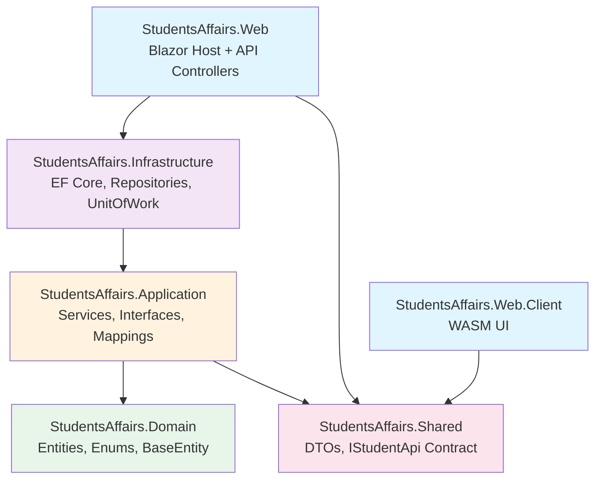
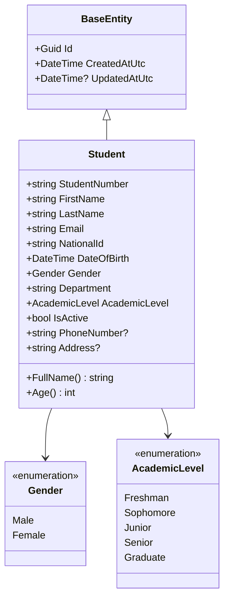
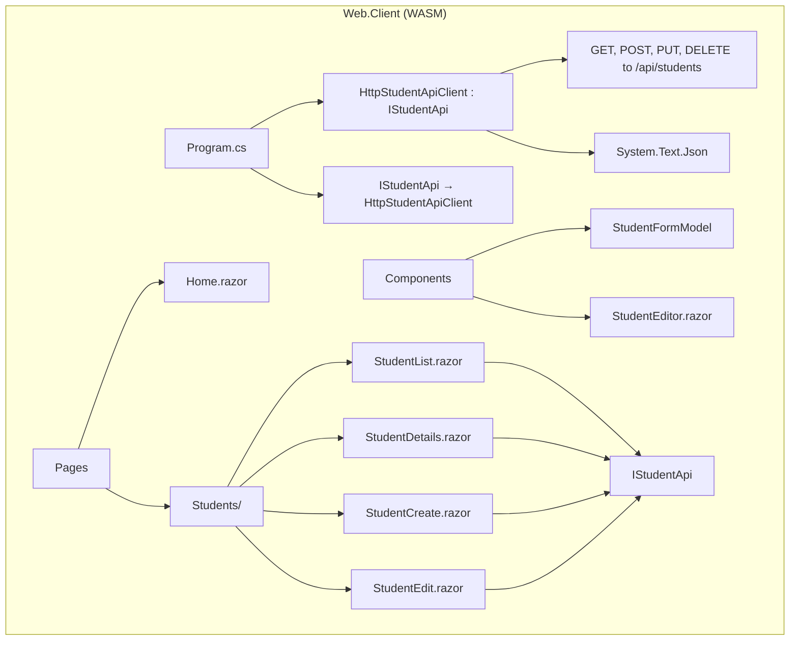
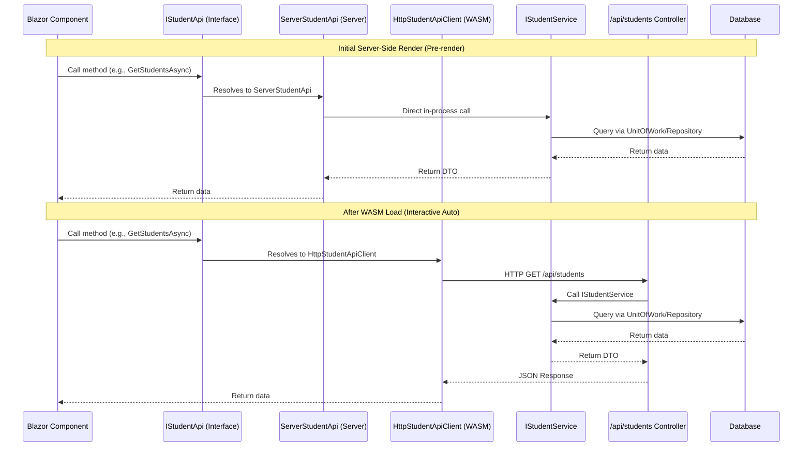
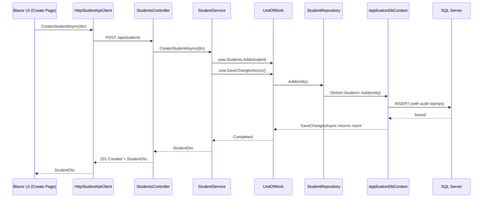
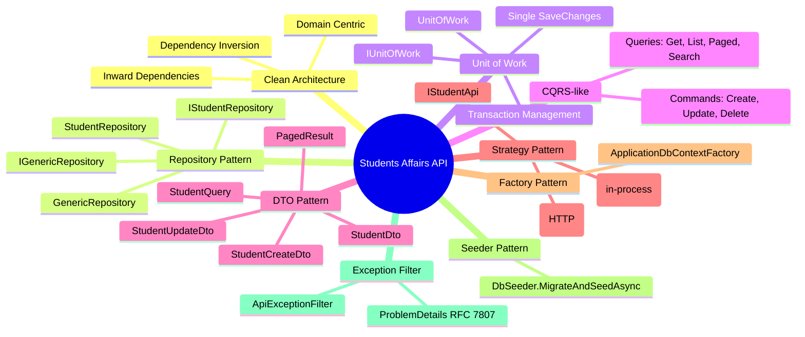
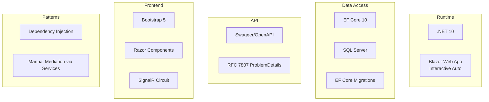

# Students Affairs API - Architecture Graphs

## 1. Solution Dependency Graph (Layer Architecture)



**Dependency Direction**: Always inward (Web → Infrastructure → Application → Domain). Outer layers never leak into inner ones.

---

## 2. Project Structure Tree

```mermaid
graph TD
    SLN[StudentsAffairs.slnx]
    
    SLN --> SRC[src/]
    SRC --> DOMAIN[StudentsAffairs.Domain]
    SRC --> SHARED[StudentsAffairs.Shared]
    SRC --> APP[StudentsAffairs.Application]
    SRC --> INFRA[StudentsAffairs.Infrastructure]
    SRC --> WEB[StudentsAffairs.Web]
    SRC --> WEB_CLIENT[StudentsAffairs.Web.Client]
    
    DOMAIN --> DOM_COMMON[Common/BaseEntity.cs]
    DOMAIN --> DOM_ENTITIES[Entities/Student.cs]
    DOMAIN --> DOM_ENUMS[Enums/Gender.cs, AcademicLevel.cs]
    
    SHARED --> SHARED_DTOS[DTOs/StudentDto, Create/Update/Query/PagedResult]
    SHARED --> SHARED_ABSTRACTIONS[Abstractions/IStudentApi.cs]
    
    APP --> APP_DI[DependencyInjection.cs]
    APP --> APP_EXCEPTIONS[Common/Exceptions/BusinessRuleException, NotFoundException]
    APP --> APP_INTERFACES[Common/Interfaces/IGenericRepository, IStudentRepository, IUnitOfWork]
    APP --> APP_MAPPING[Students/Mapping/StudentMappings.cs]
    APP --> APP_SERVICES[Students/Services/IStudentService, StudentService.cs]
    
    INFRA --> INFRA_DI[DependencyInjection.cs]
    INFRA --> INFRA_PERSISTENCE[Persistence/]
    INFRA_PERSISTENCE --> INFRA_CTX[ApplicationDbContext.cs]
    INFRA_PERSISTENCE --> INFRA_FACTORY[ApplicationDbContextFactory.cs]
    INFRA_PERSISTENCE --> INFRA_SEEDER[DbSeeder.cs]
    INFRA_PERSISTENCE --> INFRA_UOW[UnitOfWork.cs]
    INFRA_PERSISTENCE --> INFRA_CONFIG[Configurations/StudentConfiguration.cs]
    INFRA_PERSISTENCE --> INFRA_MIGRATIONS[Migrations/]
    INFRA_PERSISTENCE --> INFRA_REPOS[Repositories/GenericRepository, StudentRepository]
    
    WEB --> WEB_COMPONENTS[Components/App.razor, Pages/Error.razor]
    WEB --> WEB_CONTROLLERS[Controllers/StudentsController.cs]
    WEB --> WEB_SERVICES[Services/ApiExceptionFilter.cs, ServerStudentApi.cs]
    WEB --> WEB_PROGRAM[Program.cs]
    WEB --> WEB_WWWROOT[wwwroot/]
    
    WEB_CLIENT --> CLIENT_PAGES[Pages/Home.razor, Students/]
    CLIENT_PAGES --> CLIENT_STUDENT_PAGES[StudentList, Details, Create, Edit]
    WEB_CLIENT --> CLIENT_SERVICES[Services/HttpStudentApiClient.cs]
    WEB_CLIENT --> CLIENT_WWWROOT[wwwroot/appsettings.json]
```



---

## 3. Domain Model



---

## 4. Application Layer - Service & Repository Pattern

```mermaid
graph TD
    subgraph "Application Layer"
        STUDENT_SERVICE[StudentService : IStudentService]
        STUDENT_SERVICE --> IUNITOFWORK[IUnitOfWork]
        STUDENT_SERVICE --> ISTUDENT_REPO[IStudentRepository]
        STUDENT_SERVICE --> IGENERIC_REPO[IGenericRepository<T>]
        STUDENT_SERVICE --> MAPPING[StudentMappings]
        STUDENT_SERVICE --> EXCEPTIONS[NotFoundException, BusinessRuleException]
    end
    
    subgraph "Interfaces"
        IUNITOFWORK --> ISTUDENT_REPO_PROP[.Students : IStudentRepository]
        IUNITOFWORK --> IGENERIC_REPO_METHOD[.Repository<T>() : IGenericRepository<T>]
        IUNITOFWORK --> SAVE[.SaveChangesAsync() : Task<int>]
        IUNITOFWORK --> TRANSACTION[.BeginTransactionAsync() : Task<IDbContextTransaction>]
    end
    
    ISTUDENT_REPO --> IGENERIC_REPO
    ISTUDENT_REPO --> SPECIFIC_METHODS[GetByEmailAsync, GetByStudentNumberAsync, GetByNationalIdAsync, GetPagedAsync, GetAllAsync, GetDepartmentsAsync]
```

---

## 5. Infrastructure Layer - Implementation

```mermaid
graph TD
    subgraph "Infrastructure Layer"
        DBCONTEXT[ApplicationDbContext : DbContext]
        DBCONTEXT --> STUDENT_DBSET[DbSet<Student>]
        DBCONTEXT --> CONFIG[StudentConfiguration : IEntityTypeConfiguration<Student>]
        DBCONTEXT --> AUDIT[SaveChangesAsync - Auto Audit Stamps]
        
        UNITOFWORK[UnitOfWork : IUnitOfWork]
        UNITOFWORK --> DBCONTEXT
        UNITOFWORK --> LAZY_STUDENT_REPO[Lazy<IStudentRepository>]
        UNITOFWORK --> LAZY_GENERIC_REPO[Dictionary<Type, object> for Generic Repos]
        UNITOFWORK --> SAVE_CHANGES[SaveChangesAsync]
        UNITOFWORK --> TRANSACTION_MGMT[BeginTransactionAsync, Commit/Rollback]
        
        GENERIC_REPO[GenericRepository<T> : IGenericRepository<T>]
        GENERIC_REPO --> DBCONTEXT
        GENERIC_REPO --> CRUD[Add, Update, Remove, GetByIdAsync, GetAllAsync, FindAsync]
        
        STUDENT_REPO[StudentRepository : IStudentRepository]
        STUDENT_REPO --> GENERIC_REPO
        STUDENT_REPO --> SPECIFIC_QUERIES[GetByEmailAsync, GetByStudentNumberAsync, GetByNationalIdAsync, GetPagedAsync, GetAllAsync, GetDepartmentsAsync]
        
        DBSEEDER[DbSeeder]
        DBSEEDER --> DBCONTEXT
        DBSEEDER --> MIGRATE_AND_SEED[MigrateAndSeedAsync]
        
        FACTORY[ApplicationDbContextFactory : IDesignTimeDbContextFactory]
        FACTORY --> DBCONTEXT
    end
```



---

## 6. Web Layer - API & Server Implementation

```mermaid
graph TD
    subgraph "Web Layer (Server)"
        PROGRAM[Program.cs]
        PROGRAM --> DI[Configure Services]
        PROGRAM --> MIDDLEWARE[Configure Pipeline]
        PROGRAM --> SEEDER[DbSeeder.MigrateAndSeedAsync]
        
        CONTROLLER[StudentsController : ControllerBase]
        CONTROLLER --> ISTUDENT_SERVICE[IStudentService]
        CONTROLLER --> ROUTES[GET /api/students, /all, /departments, /{id}]
        CONTROLLER --> ROUTES_POST[POST /api/students]
        CONTROLLER --> ROUTES_PUT[PUT /api/students/{id}]
        CONTROLLER --> ROUTES_DELETE[DELETE /api/students/{id}]
        CONTROLLER --> PROBLEM_DETAILS[ApiExceptionFilter → RFC 7807 ProblemDetails]
        
        SERVER_API[ServerStudentApi : IStudentApi]
        SERVER_API --> ISTUDENT_SERVICE
        SERVER_API --> IN_PROCESS[Direct in-process calls - no HTTP]
        
        EXCEPTION_FILTER[ApiExceptionFilter : IExceptionFilter]
        EXCEPTION_FILTER --> NOT_FOUND[NotFoundException → 404]
        EXCEPTION_FILTER --> BUSINESS_RULE[BusinessRuleException → 400/409]
        EXCEPTION_FILTER --> GENERIC[Exception → 500]
    end
```

---

## 7. Web.Client Layer - WASM UI



---

## 8. IStudentApi - Dual Implementation Pattern (Interactive Auto)



---

## 9. Unit of Work / Repository Flow

```mermaid
flowchart TD
    SERVICE[StudentService] --> UOW[IUnitOfWork]
    UOW --> STUDENT_REPO[.Students : IStudentRepository]
    UOW --> GENERIC_REPO[.Repository<T>() : IGenericRepository<T>]
    UOW --> SAVE[.SaveChangesAsync()]
    UOW --> TRANSACTION[.BeginTransactionAsync()]
    
    STUDENT_REPO --> GEN_REPO_BASE[GenericRepository<Student>]
    GENERIC_REPO --> GEN_REPO_BASE
    
    GEN_REPO_BASE --> DBSET[DbSet<Student>]
    DBSET --> DBCONTEXT[ApplicationDbContext]
    DBCONTEXT --> DATABASE[(SQL Server)]
    
    style SERVICE fill:#fff3e0
    style UOW fill:#f3e5f5
    style STUDENT_REPO fill:#e8f5e9
    style GENERIC_REPO fill:#e8f5e9
    style DBCONTEXT fill:#e1f5fe
    style DATABASE fill:#fce4ec
```

**Key Principle**: Repositories only stage changes (Add/Update/Remove). **Only UnitOfWork calls SaveChangesAsync()** → one service call = one transaction.

---

## 10. Data Flow - Create Student Example



---

## 11. Database Schema (Students Table)

```mermaid
erDiagram
    STUDENTS {
        uniqueidentifier Id PK
        nvarchar(20) StudentNumber UK
        nvarchar(100) FirstName
        nvarchar(100) LastName
        nvarchar(256) Email UK
        nvarchar(20) NationalId UK
        date DateOfBirth
        int Gender "0=Male, 1=Female"
        nvarchar(100) Department
        int AcademicLevel "0=Freshman..4=Graduate"
        bit IsActive
        nvarchar(20) PhoneNumber NULL
        nvarchar(500) Address NULL
        datetime2 CreatedAtUtc
        datetime2 UpdatedAtUtc NULL
    }
```

---

## 12. REST API Endpoints

```mermaid
graph LR
    subgraph "GET"
        A1[/api/students] --> Q1[Query: search, department, isActive, sortBy, sortDesc, page, pageSize]
        A2[/api/students/all] --> Q2[No paging]
        A3[/api/students/departments] --> Q3[Distinct departments]
        A4[/api/students/{id}] --> Q4[Single student]
    end
    
    subgraph "POST"
        B1[/api/students] --> BODY1[StudentCreateDto]
    end
    
    subgraph "PUT"
        C1[/api/students/{id}] --> BODY2[StudentUpdateDto]
    end
    
    subgraph "DELETE"
        D1[/api/students/{id}] --> D1B[204 No Content]
    end
    
    subgraph "Responses"
        R1[PagedResult<StudentDto>]
        R2[List<StudentDto>]
        R3[List<string>]
        R4[StudentDto]
        R5[201 Created]
        R6[200 OK]
        R7[204 No Content]
        R8[404 Not Found]
        R9[400 Bad Request]
        R10[409 Conflict]
        R11[ProblemDetails RFC 7807]
    end
```

---

## 13. Key Design Patterns Used



---

## 14. Technology Stack



---

## 15. Deployment / Run Flow

```mermaid
flowchart TD
    START[dotnet run --project src/StudentsAffairs.Web] --> BUILD[Build Solution]
    BUILD --> MIGRATE[Apply Migrations]
    MIGRATE --> SEED[DbSeeder.MigrateAndSeedAsync]
    SEED --> SEED_DATA[Insert 5 Demo Students]
    SEED_DATA --> HOST[Kestrel Host Starts]
    HOST --> URLS[HTTP: http://localhost:5xxx<br/>HTTPS: https://localhost:7xxx]
    URLS --> SWAGGER[Swagger UI at /swagger]
    URLS --> BLAZOR[Blazor UI at /]
    BLAZOR --> PAGES[/, /students, /students/create, /students/{id}, /students/{id}/edit]
```